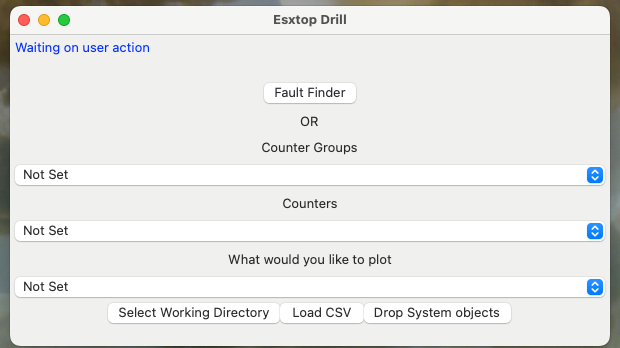

# Fork of esxtop drill V2

The project is attempt to make the application 
- System UI compatible to MAC and Windows
  - The code now supports both MAC and Windows
  - There is a Mac app available for downland 
  - WIP: Windows App
    - McAfee treats it as a virus!!
- WIP: Convert to an API driven webapp

### Starting the Mac app
1. Download the Mac_Application Dir
2. Navigate to Mac_Application
3. Start EsxtopDrill app
4. Wait for application to load 
5. For the first Run application can take some time 
6. Once the application has started you should see below UI 
7. The application log can be found under ~/esxtop_drill.log

### Using the app

1. Select the Working Directory. This is the location where all the output files will be stored. Each counter group will have its on Directory.
2. Load The CSV 
3. Provide the Name of the Object. This can be a VM, Naa ID, NIC etc. You can leave it blank as well. In this case the output will not be filtered for the object 
3. Drop System Objects if you are working with an Object level issue, else you can ignore this step
4. Use Fault Finder or Drops downs to check on various counters in the data
5. More details at refer How to use? section of https://vmzoneblog.com/2020/09/15/esxtopdrill-v2-with-fault-finder/
